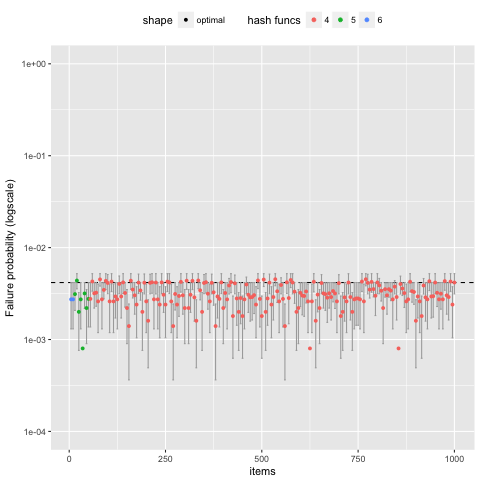

# IBLT-optimization

IBLTs are a probabilistic data structure for recovering the symmetric difference between two sets of items [1]. To recover the symmetric difference, the items in each set are inserted into separate IBLTs. One IBLT is subtracted [2] from the other, and then a decoding operation recovers the *n* items in the symmetric difference. 

For IBLTs to be practical, they have to be parameterized to meet a desired decode rate *p*. For example, we may set _p=0.995_. Of all IBLT settings that meet or exceed the decode rate, we want the parameters that result in the smallest size IBLT. The two values that parameterize an IBLT are its hedge factor *h* and the number of hash functions *k* used to insert an item. It turns out that optimizing these parameters depends on both *p* and *n*.

The code in this repository is a C++ implementation of IBLTs, as well as a Python wrapper. The code can generate and make use of a csv file containing the optimal values for a given symmetric differences.  The repository contains a file (**param.export.0.995833.2018-07-17.csv**) generated previously for IBLTs recovering a symmetric difference from n=1...1000 item for a decode rate of *p=239/240* (which is about 99.5833%). Using scripts in this repo, the parameter file can be tested, and the optimal values can be recreated or created for a different value of *p*. Finally, a short script converts the csv into a C++ header file. 

The optimal values are generated by brute force, with some efficiencies (binary search over each *k*, with some pruning). This grid search is necessary because previous analytical work has derived only asymptotic results for choosing *h* and *k*; In other words, these values produce a very high failure rate for about *n<600*.

# Compilation

To compile the shared library, execute:

```$ make```

The existing Makefile has been tested on only MacOS and likely needs adjustment for your system.


# Short Tests and example code

To run a set short CPP-based tests:
```
$ make test
$ ./iblt_test
Tests successful.
```

A short python example is in **test.py**, and the **binary_search.py** file serves as additional code examples.  If working correctly, the output of test.py is

```
$ python3 test.py
F Entries: 
True
8 ('txn_10008', 1)
2 (' txn_1002', 1)
G Entries: 
True
8 ('txn_10008', 1)
7 ('txn_10010', 1)

h=g-f;  should have 7, and then 2:
True
2 (' txn_1002', -1)
7 ('txn_10010', 1)

h=f-g;  should have 2, and then 7:
True
2 (' txn_1002', 1)
7 ('txn_10010', -1)
```

A 1 in the output means that the key was found only in the minuend, and a -1 means the key was found only in the subtrahend. For example, in *h=g-f*, the IBLT *g* is the minuend, and the IBLT *f* is the subtrahend.

# Generating the CSV File

To generate the csv parameter file, run the binary search python script once for each size of *n*. An R script takes all results and produces a csv. If desired, the csv can be converted into a valid CPP header file; see below. The following produces output for *n=20* and a decode rate of 239/240. 

```python3 binary_search.py 20 239 240```

We generated all output on a compute cluster, hence there is no main file that iterates over all values of *n*. Each run of binary_search.py produces its own output file. 

Here's sample output file produced by the above command:

```
20, 0.995833, 4, 3.200000, 64, 9461, 9490
20, 0.995833, 3, 5.700000, 114, 8324, 8349
20, 0.995833, 5, 2.500000, 50, 6589, 6608
20, 0.995833, 6, 2.400000, 48, 5405, 5420
20, 0.995833, 7, 2.450000, 49, 12531, 12571
20, 0.995833, 8, 2.800000, 56, 5000, 5000
20, 0.995833, 9, 3.150000, 63, 5000, 5000
20, 0.995833, 10, 3.500000, 70, 5000, 5000
20, 0.995833, 11, 3.300000, 66, 16086, 16139
20, 0.995833, 12, 3.600000, 72, 4992, 5000
```
The script always runs *k=4* first as this tends to be the best choice; searches for other values of *k* are pruned based on the size resulting from *k=4*. In this case, we can see the optimal setting is indeed *k=4*, which results in a hedge factor of *h=3.0* and an IBLT of 60 rows. When the script executed, it  observed a decode rate of 9461/9490=0.9969441517 for *k=4* and *h=3.2*. This proportion is acceptable statistically because it has a 95% confidence interval of 

```ci = 1.96 *sqrt(9461/9490\* (1-9461/9490) / 9490) = 0.001110514601```

That is the desired decode is higher and outside the 95% ci:

```239/240 < (0.9969441517-0.001110514601)```

For *n=20*, the output file contains *k=6* and *h=2.4* as that results in the smallest number of rows: 48. 

An R script included with this repository aggregates all output and produces the CSV:

```Rscript parse_bin_search.R```

An example output csv is included:  **param.export.0.995833.2018-07-17.csv**

The failure rate and confidence interval of every 5th row of the csv file is shown in the plot below. Error bars are the 95% confidence interval. The dotted line is the desired failure rate of *1-239/240*.



# Testing the CSV parameter file

A script is included that tests each value of the CSV parameter file. The script uses python's multiprocessing library, and the number of PROCESSES should be adjusted at the top of the file.

```python3 confirm-rate.py param.export.0.995833.2018-07-17.csv```

Output from the file is sent to the command line as it runs. The test again uses confidence intervals to evaluate statistical significance. 

Here's the output for testing 20:

```
20, 2.400000, 6, 48, 1410, 1411, 0.999291, 0.001389, 1444, 1445, 0.999308, 0.001356
```
We can see that the size is confirmed to be 48, and there are two independent trials. In the first, the decode rate is 
found to be  1410/1411=0.999291 +/- 0.001389. In the second, the decode rate is found to be 1444/1445=0.999308 +/- 0.001356. 
Both are above the desired decode rate of 230/240 even when accounting for the confidence interval. 

# Converting to a CPP header file

A script called **python_parse_csv.py** can be used to convert a csv file to a CPP header. The filename is hardcoded into the python file. 

```$ python3 parse_csv.py```

The output is written to **iblt_params.h**, which is included in the repository as an example. 


Credits:

* [CPP code](https://github.com/gavinandresen/IBLT_Cplusplus) originally by Gavin Andresen
* Python wrapper and generation of optimal values by Brian Levine
* CPP header file generation George Bissias

# Credits
This work was as part of the **Graphene** project at **UMass Amherst College of Information and Computer Sciences**. 

More info: http://forensics.umass.edu/graphene/

Short Paper: http://forensics.cs.umass.edu/graphene/graphene-short.pdf

Graphene authors: 
A. Pinar Ozisik, Gavin Andresen, George Bissias, Amir Houmansadr, and Brian N. Levine.

# References

[1] Goodrich, M., And Mitzenmacher, M. [Invertible bloom lookup tables](https://arxiv.org/abs/1101.2245)
. In Proceedings of Conference on Communication, Control, and Computing (Sept 2011), pp. 792–799.

[2] Eppstein, D., Goodrich, M. T., Uyeda, F., And Varghese, G. [What’s the Difference?: Efficient Set Reconciliation Without Prior Context](https://www.ics.uci.edu/~eppstein/pubs/EppGooUye-SIGCOMM-11.pdf). In Proceedings of ACM SIGCOMM (2011).

